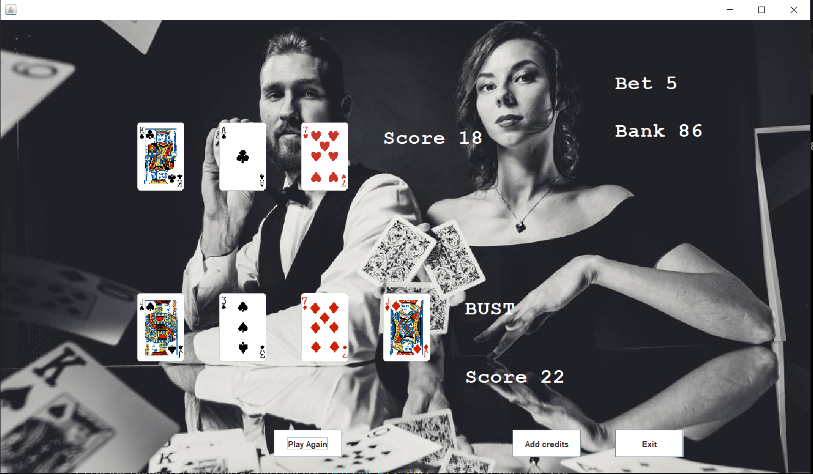

# BlackJack
BlackJack game for OOP, made in year two of studies for an Object Oriented Programming module
No change to game code since OOP module.
Updated with folder containing jar file and resources. To run game - clone repo and cd into Blackjackjar folder, then use the command:  java -jar .\BlackJack.jar

<h2>Screenshots</h2>
<h3>Login and Highscores</h3>

<h3>Game Screen</h3>

